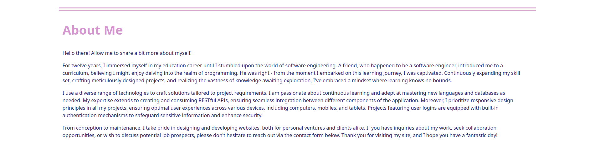

<a name="readme-top"></a>

<br />
<div align="center">
   
  </a>

<h3 align="center">Portfolio Website</h3>

  <p align="center">
    Full Stack Software Engineer
    <br />
    <a href="https://amiriel01-portfolio-website.netlify.app/">View Demo</a>
    ·
    <a href="https://github.com/Amiriel01/Portfolio-Website/issues">Report Bug</a>
  </p>
</div>

<details>
  <summary>Table of Contents</summary>
  <ol>
    <li>
      <a href="#about-the-project">About The Project</a>
      <ul>
        <li><a href="#website-images-and-descriptions">Website Images and Descriptions</a></li>
      </ul>
      <ul>
        <li><a href="#built-with">Built With</a></li>
      </ul>
    </li>
    <li>
      <a href="#getting-started">Getting Started</a>
      <ul>
        <li><a href="#installation">Installation</a></li>
      </ul>
    </li>
    <li><a href="#contributing">Contributing</a></li>
    <li><a href="#acknowledgments">Acknowledgments</a></li>
  </ol>
</details>

## About The Project

I created this full stack software engineer website to showcase my latest projects, tell a little more about myself and my tech stack qualifications, and also so I could have a place others could contact me in the event they had questions about my projects, wanted to collaborate on projects, or for potential employement opportunities. I used React, JavaScript, MongoDB, Express, and Node.js for this project. I also used Bootstrap for some of the style elements.

### Website Images and Descriptions

**Header Section**

The header section of my project features a scroll to location, and the hero section with an image and a brief introduction.


**Projects Section**

The projects section features my latest projects with information about each project, login credentials for demos if needed, links to the GitHub repositories and live demo sites, and the tech stacks used for each project.


**About Section**

The about section is where I put the information provided about me and my software engineer journey.



**Technical Skills Section**

In the technical skills section I have listed the skills I currently use on a regular basis in projects along with their icons.


**Contact Section**

Website visitors are able to send me a contact message if they would like to collaborate on a project, have questions about any of my projects, or would like to discuss employement opportunities. The contact form contents are sent when the form is submitted. 


<p align="right">(<a href="#readme-top">back to top</a>)</p>

### Built With

* [![Node][Node.js]][Node-url]
* [![React][React.js]][React-url]
* 
* [![React-Router][React-Router.com]][React-Router-url]
* [![Vite][vite.js]][Vite-url]
* [![Bootstrap][Bootstrap.com]][Bootstrap-url]
* 
* [![Express][Express.js]][Express-url]
* [![MongoDB][MongoDB.com]][MongoDB-url]
* [![Nodemon][Nodemon.io]][Nodemon-url]
* [![NPM][NPM.io]][NPM-url]
* [![VSCode][VSCode.com]][VSCode-url]

<p align="right">(<a href="#readme-top">back to top</a>)</p>

## Getting Started

To get a local copy up and running follow these simple example steps.

### Installation

1. Clone the repo
   ```sh
   git clone https://github.com/Amiriel01/Readers-Theater
   ```
2. Install NPM packages
   ```sh
   npm install
   ```
3. Connect you MongoDB database `app.ts`
  
<p align="right">(<a href="#readme-top">back to top</a>)</p>

## Acknowledgments

* [Pexels: Website Images](https://www.pexels.com/)
* [Devicons: Technical Skilss](https://devicon.dev/)

[Node.js]: https://img.shields.io/badge/node.js-6DA55F?style=for-the-badge&logo=node.js&logoColor=white
[Node-url]: https://nodejs.org/en
[React.js]: https://img.shields.io/badge/React-%2320232a?style=for-the-badge&logo=react&logoColor=%2361DAFB
[React-url]: https://reactjs.org/
[React-Router.com]: https://img.shields.io/badge/React_Router-CA4245?style=for-the-badge&logo=react-router&logoColor=white
[React-Router-url]: https://reactrouter.com/en/main
[Vite.js]: https://img.shields.io/badge/vite-%23646CFF.svg?style=for-the-badge&logo=vite&logoColor=white
[Vite-url]: https://vitejs.dev/
[Bootstrap.com]: https://img.shields.io/badge/Bootstrap-%238511FA?style=for-the-badge&logo=bootstrap&logoColor=white
[Bootstrap-url]: https://getbootstrap.com
[TypeScript.com]: https://img.shields.io/badge/typescript-%23007ACC.svg?style=for-the-badge&logo=typescript&logoColor=white
[TypeScript-url]: https://www.typescriptlang.org/
[Express.js]: https://img.shields.io/badge/express.js-%23404d59.svg?style=for-the-badge&logo=express&logoColor=%2361DAFB
[Express-url]: https://expressjs.com/
[MongoDB.com]: https://img.shields.io/badge/MongoDB-%234ea94b.svg?style=for-the-badge&logo=mongodb&logoColor=white
[MongoDB-url]: https://www.mongodb.com/
[Nodemon.io]: https://img.shields.io/badge/NODEMON-%23323330.svg?style=for-the-badge&logo=nodemon&logoColor=%BBDEAD
[Nodemon-url]: https://nodemon.io/
[NPM.io]: https://img.shields.io/badge/NPM-%23CB3837.svg?style=for-the-badge&logo=npm&logoColor=white
[NPM-url]: https://www.npmjs.com/
[VSCode.com]: https://img.shields.io/badge/Visual%20Studio-5C2D91.svg?style=for-the-badge&logo=visual-studio&logoColor=white
[VSCode-url]: https://code.visualstudio.com/

